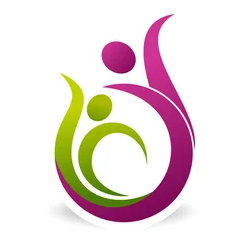

---
hide:
  - navigation
  - toc
---

# **Envie de retrouver calme, confiance, harmonie et optimisme ?**

---

La **sophrologie caycédienne** vous accompagne à vous projeter avec regard positif sur la vie et les autres.

Riche de mon expérience de pédagogue auprès des enfants en particulier et des adolescents, de ma pratique en sophrologie et en yoga auprès d’adultes, je peux vous accompagner à réduire votre stress au travail, améliorer votre sommeil, aider à préparer des examens ou des moments difficiles, mieux gérer vos émotions.

 

* <a href="./informations/contacts/" title="home-link" class="button">Informations pratiques</a>

* <a href="./informations/visio/" title="home-link" class="button">Les liens de viso conférence</a>

 

    
    
